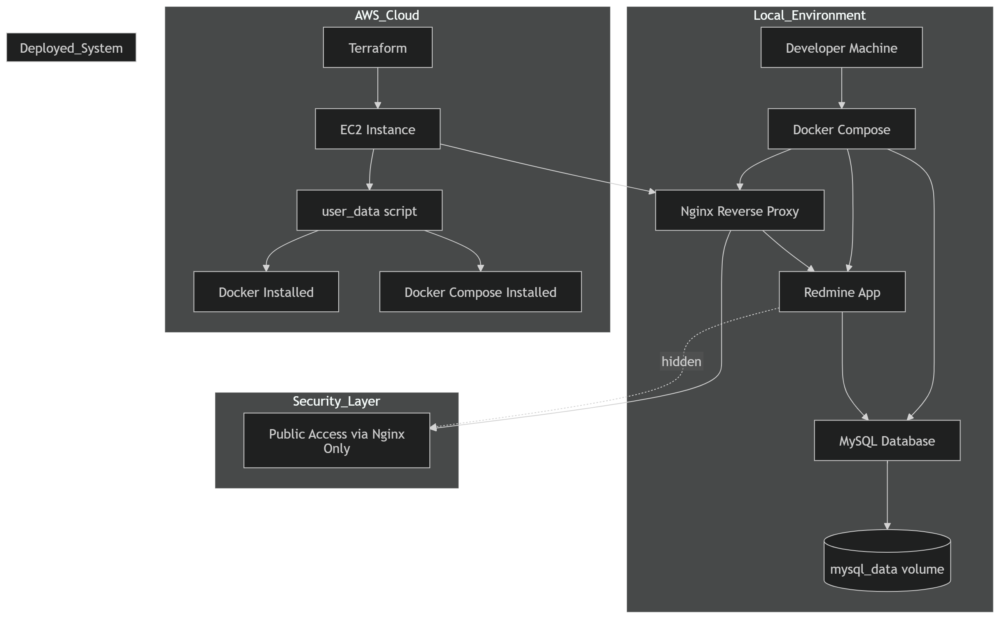

# 🚀 Redmine Hybrid DevOps Architecture (AWS + Terraform + Docker)
### ⚡ Production-Style Infrastructure Project

This project demonstrates a real-world DevOps hybrid system combining:

- Local containerized development (Docker Compose)
- Cloud infrastructure provisioning (Terraform on AWS)
- Secure deployment architecture using Nginx reverse proxy
- Automated EC2 bootstrap using user_data
- SSH-based secure access using key pairs
- Automated demo data generation using Ruby seed scripts

## 🧠 What Makes This Project Stand Out

✔ Full Infrastructure as Code (Terraform)
✔ Cloud + Local hybrid architecture
✔ Secure reverse proxy (Nginx hides backend IP)
✔ Automated server provisioning (user_data)
✔ Reproducible development environment
✔ Realistic enterprise-style workload simulation

## 🏗️ Architecture Overview


### 📌 What this diagram shows

✔ Local vs Cloud separation
✔ Infrastructure as Code (Terraform)
✔ Automated EC2 bootstrap (user_data)
✔ Reverse proxy security (Nginx hides app IP)
✔ Multi-container architecture
✔ Persistent storage (MySQL volume)


## 🏗️ Architecture
Local Environment

Docker Compose services:

app → Redmine application
web → Nginx reverse proxy
db → MySQL database

The application is accessed through Nginx instead of directly exposing the Redmine container, following a reverse proxy architecture pattern commonly used in production environments.

## ☁️ AWS Infrastructure

Infrastructure is provisioned using Terraform:

EC2 instance
Security groups
SSH key pair access
Automated EC2 bootstrap using user_data

The user_data.sh script automatically:

installs Docker
installs Docker Compose
enables Docker services
prepares the deployment environment
🔐 Secure Remote Access

SSH key-based authentication is configured locally using:

```ssh-keygen -f .ssh/redminekey```

This allows secure remote access to the EC2 instance without password authentication.

🌐 Reverse Proxy Setup (Nginx)

Nginx acts as a reverse proxy between public traffic and the Redmine application.

Request flow:

```User → Nginx → Redmine App → MySQL```

Instead of exposing the application directly to the internet, Nginx forwards traffic internally using Docker networking:

```http://app:3000```

Here:

- app is the Docker Compose service name
- 3000 is the internal Redmine application port

This architecture improves:

- security
- traffic control
- scalability
- environment abstraction
  
## 🌱 Automated Demo Data

A Ruby on Rails seed script is used to automatically generate realistic demo data after deployment.

Generated datasets include:

### 👥 HR System

onboarding workflows
payroll issues
leave requests

🖥️ IT Helpdesk

VPN issues
email downtime
support tickets

🚀 DevOps Backlog

CI/CD improvements
Terraform infrastructure tasks
monitoring setup

⚙️ Tech Stack

Docker
Docker Compose
Terraform
AWS EC2
Amazon Linux 2
Nginx
MySQL 8
Redmine (Ruby on Rails)
Bash scripting
SSH

## 🚀 Deployment Workflow

1. Generate SSH Key Pair
   
```bash
ssh-keygen -t rsa -b 4096
```

3. Provision AWS Infrastructure

```bash
cd terraform
terraform init
terraform apply
```

4. EC2 Auto Configuration

The EC2 instance automatically installs:

Docker
Docker Compose

using the user_data.sh script.

4. Deploy Application
   
```bash
docker compose up -d
```

6. Generate Demo Data
   
```bash
bash redmine/docker/seed.sh
```

🎥 Demo Video

📺 YouTube Demo:

https://www.youtube.com/watch?v=mLsIiDWyQfk

##💡 Key DevOps Concepts Demonstrated

Infrastructure as Code (IaC)
Hybrid architecture
Container orchestration
Reverse proxy architecture
Cloud provisioning
Automated server bootstrap
Persistent storage management
Secure SSH-based access

Environment reproducibility
